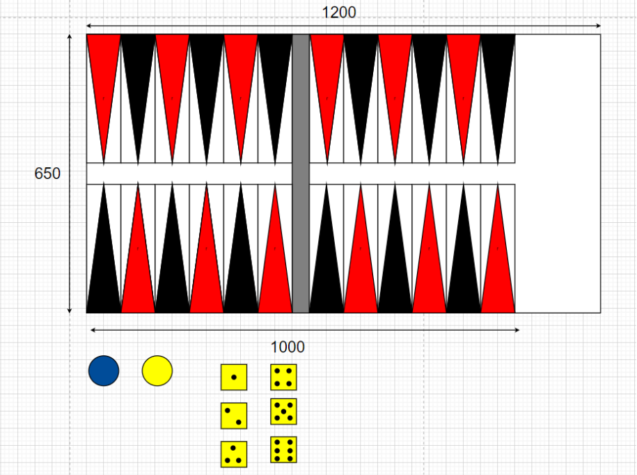

# Backgammon with Socket Programming
In this project, a multi-client backgammon game was made by socket programming. Players connect to a server and the server assigns a color to these players. 
Then the server matches the players in groups of 2 and the players start playing the game.

# App Design

After clicking the connect button, the server is connected.

## Game Over and Win Conditions

## Sketch Design
